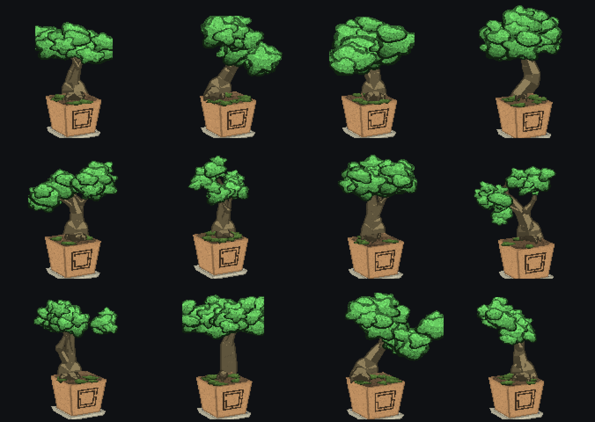

# Omatree

A living bonsai on your Omarchy bar. It is grown from a seed unique to this
machine and user, ages with your system and with you over weeks, and is shaped
by hand into whatever form you prune it toward. No two are ever alike.

Omatree is a meditation widget, not a pet sim. Decline is slow and forgiving.
It rewards one unhurried visit a day.



## Install

```sh
omarchy plugin add https://github.com/Tiedeyez/omatree --enable
```

This clones the repo into `~/.config/omarchy/plugins/`, registers the service
and bar widget, and reloads the shell. A small sprout appears in the bar's
right section.

## Remove

```sh
omarchy plugin remove jimmie.bonsai
```

Removing the plugin deletes its folder. Your tree's saved state lives
separately at `~/.local/state/omarchy/bonsai-state.json` — delete that file too
for a completely clean slate, or leave it and the same tree returns if you
reinstall.

## Using it

- **Bar mark.** A tiny bonsai whose canopy grows with the real tree. It
  sparkles when thriving, wilts amber when it needs you, and a firefly blinks
  beside it after dark.
- **Left-click** opens the panel: the tree, its mood, its life stage, and four
  slim care meters — water, light, feed, form — each with a pill to tend it.
- **Middle-click** the bar mark waters the tree without opening anything.
- **Plant** from seed or from a cutting the first time. A matured tree can set
  a single berry; its seed carries to the next pot on the same machine.
- **Prune by hand.** In the panel's trim mode, pick a cluster and cut. Cuts are
  permanent and the tree grows on from them — this is how you give it its form.
- **Rotate** the tree by dragging it, middle-clicking to step 30°, or focusing
  it and using the arrow keys.
- **Set it on the desktop.** From the panel, send the tree out onto the
  wallpaper as a standalone ornament with its own small controls. Hover it for
  `TAKE ME HOME` to bring it back to the bar.

Full keyboard navigation is available throughout the panel (`↑↓`/`jk` to move,
`Enter`/`Space` to act, `w`/`f`/`p` shortcuts).

### Care pacing

Growth is deliberately slow — roughly a couple of months of daily use from
sprout to a mature bonsai. Water is asked for by the end of a day's use; light
over days; feed over weeks; form only seasonally, and it never nags.

## If you also run Omagotchi

Install [Omagotchi](https://github.com/slcode777/omagotchi) alongside Omatree and
its creature comes to live in the tree. Its actual sprite — the current form,
awake or asleep — perches in the canopy on the bar mark, and the panel grows a
strip below the care meters where you can feed it, wash it, and rest a hand on
its back, all from the same keyboard cursor as the tree's own care. No sound, no
emotes; the tree just quietly notices.

The pet's own bar pill keeps working and stays in step, so you can tuck it away
and let the tree be the one place you tend both. Remove Omagotchi and the tree
goes back to being just a tree.

## How it works

Identity (machine-id + user) is hashed into a deterministic seed. From that
seed a 3D skeleton is grown (`Grow.js`), projected and shaded into a draw list
(`Paint.js`), and rasterised to pixel art (`Raster.js`). One grown object —
roots, trunk and branches connect with real physics, not assembled parts. The
Omarchy wordmark is etched into the pot clay.

Genus (juniper, maple, pine) and classical style (formal, informal, slant,
cascade, windswept, literati, broom, twin) are drawn from the seed.

A headless service keeps the tree living — growing, ageing, getting thirsty —
while the panel is closed.

## Dependencies

None at runtime beyond the Omarchy Quattro shell (Quickshell / QML). The tree
renders fully offline; nothing is fetched over the network. Node.js is used
only by the optional developer scripts in `dev/`.

## Development

See [`dev/README.md`](dev/README.md) for the render pipeline and the three ways
to time-travel through the tree's life (still frames, terminal timelapse, live
panel override).

Validate a working copy:

```sh
omarchy plugin validate ~/.config/omarchy/plugins/jimmie.bonsai
```

## License

MIT — see [LICENSE](LICENSE). Authored by Tiedeyez.
